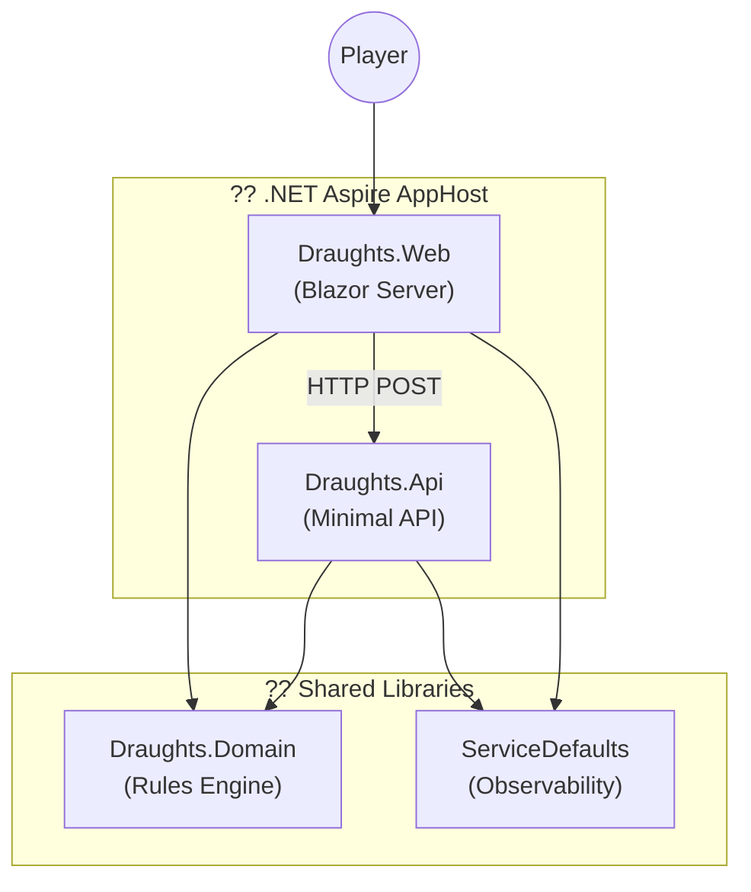

# ARF.Games.Draughts - Technical Documentation

> **Version:** 1.0.0  
> **Iteration:** 001-MVP  
> **Status:** Active Development  
> **Target Framework:** .NET 10 / C# 14

## Overview

ARF.Games.Draughts is a browser-based Spanish Draughts (Checkers) game built with .NET Aspire, featuring a Blazor Server frontend and a Minimal API backend for AI move computation. The game implements authentic Spanish draughts rules including mandatory captures and flying kings.

## Documentation Index

| Document | Description |
|----------|-------------|
| [Architecture Overview](architecture.md) | System architecture, component design, and deployment model |
| [Code Overview](code-overview.md) | Project structure, namespaces, and key classes |
| [API Reference](api-reference.md) | REST API endpoints and contracts |
| [Domain Model](domain-model.md) | Game entities, rules engine, and business logic |
| [Development Guide](development-guide.md) | Setup, build, test, and contribution guidelines |

## Quick Start

```bash
# Clone and build
git clone https://github.com/alexanderfewtrell/ARF.Games.Draughts.git
cd ARF.Games

# Run with .NET Aspire orchestration
dotnet run --project src/Draughts.AppHost
```

The application will start with:
- **Draughts.Web** - Blazor Server UI at `https://localhost:xxxx`
- **Draughts.Api** - AI Move API at `https://localhost:xxxx`
- **.NET Aspire Dashboard** - Observability at `https://localhost:xxxx`

## Architecture at a Glance



## Key Features

- **Spanish Draughts Rules** - 8x8 board with mandatory capture and flying kings
- **Single Player vs AI** - Basic AI opponent using legal move selection
- **Accessibility-First UI** - High contrast, keyboard navigation, ARIA labels
- **.NET Aspire Orchestration** - Service discovery, health checks, OpenTelemetry
- **Clean Architecture** - Domain-driven design with clear boundaries

## Technology Stack

| Layer | Technology |
|-------|------------|
| Orchestration | .NET Aspire 9.0 |
| Frontend | Blazor Server |
| Backend | ASP.NET Core Minimal APIs |
| Domain | Pure C# domain services |
| Observability | OpenTelemetry, structured logging |
| Testing | xUnit, bUnit |

## Project Status

This is an MVP (Minimum Viable Product) implementation focused on:

? Core gameplay loop (move, capture, king promotion)  
? Spanish draughts rule enforcement  
? Basic AI opponent  
? Game state management  
? Win/loss/draw detection  

**Out of Scope for MVP:**
- Multiplayer mode
- User accounts and persistence
- Multiple AI difficulty levels
- Game save/resume functionality

## Related Documentation

- [Statement of Requirements (SOR)](../001-mvp/SOR/draughts-sor.md)
- [Technical Specifications](../001-mvp/specs/overview-spec.md)
- [Build Plan](../001-mvp/plans/build-plan.md)

---

*Last Updated: 2025*
