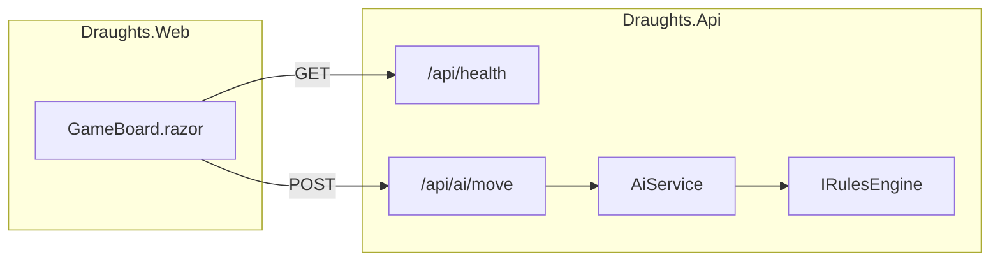
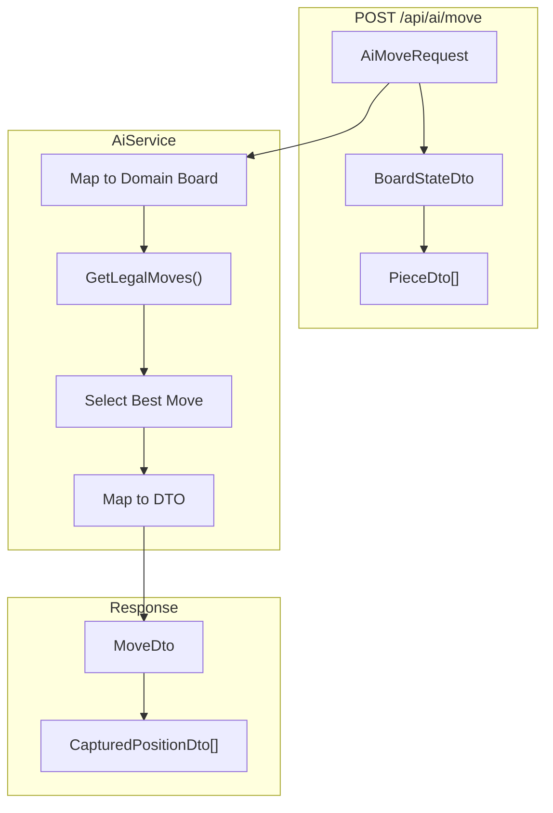

# API Reference

> **Document Type:** API Documentation  
> **Version:** 1.0.0  
> **Last Updated:** 2025  
> **Base URL:** `https://localhost:{port}/api`

## Table of Contents

- [Overview](#overview)
- [Endpoints](#endpoints)
  - [Health Check](#health-check)
  - [AI Move](#ai-move)
- [Data Models](#data-models)
- [Error Handling](#error-handling)
- [Examples](#examples)

---

## Overview

The Draughts API is a Minimal API backend that provides AI move computation for the Spanish Draughts game. It exposes a simple REST interface for the Blazor frontend to request AI opponent moves.

### Base Configuration

| Setting | Value |
|---------|-------|
| Protocol | HTTPS |
| Content-Type | application/json |
| Authentication | None (MVP) |
| CORS | AllowAnyOrigin (development) |

### API Architecture



---

## Endpoints

### Health Check

Check API availability and status.

```http
GET /api/health
```

#### Response

**Status:** `200 OK`

```json
{
  "status": "Healthy"
}
```

#### Example

```bash
curl -X GET https://localhost:62588/api/health
```

---

### AI Move

Request an AI move based on the current board state.

```http
POST /api/ai/move
Content-Type: application/json
```

#### Request Body

| Field | Type | Required | Description |
|-------|------|----------|-------------|
| `Board` | `BoardStateDto` | Yes | Current board configuration |
| `Player` | `string` | Yes | AI player: `"Black"` or `"White"` |

**BoardStateDto:**

| Field | Type | Description |
|-------|------|-------------|
| `Pieces` | `PieceDto[]` | Array of pieces on the board |

**PieceDto:**

| Field | Type | Description |
|-------|------|-------------|
| `Row` | `int` | Row position (0-7) |
| `Col` | `int` | Column position (0-7) |
| `Owner` | `string` | `"White"` or `"Black"` |
| `Type` | `string` | `"Man"` or `"King"` |

#### Response

**Status:** `200 OK` - Move computed successfully

```json
{
  "fromRow": 2,
  "fromCol": 3,
  "toRow": 3,
  "toCol": 4,
  "capturedPositions": null
}
```

**Status:** `200 OK` - Capture move

```json
{
  "fromRow": 2,
  "fromCol": 3,
  "toRow": 4,
  "toCol": 5,
  "capturedPositions": [
    { "row": 3, "col": 4 }
  ]
}
```

**Status:** `204 No Content` - No legal moves available (game over)

**Status:** `400 Bad Request` - Invalid request

#### Response Schema

**MoveDto:**

| Field | Type | Description |
|-------|------|-------------|
| `FromRow` | `int` | Origin row (0-7) |
| `FromCol` | `int` | Origin column (0-7) |
| `ToRow` | `int` | Destination row (0-7) |
| `ToCol` | `int` | Destination column (0-7) |
| `CapturedPositions` | `CapturedPositionDto[]?` | Captured piece positions |

**CapturedPositionDto:**

| Field | Type | Description |
|-------|------|-------------|
| `Row` | `int` | Captured piece row |
| `Col` | `int` | Captured piece column |

---

## Data Models

### Request Flow Diagram



### Board Coordinate System

```
        Column
        0   1   2   3   4   5   6   7
     ?????????????????????????????????
  0  ?   ? ? ?   ? ? ?   ? ? ?   ? ? ?  Row 0
     ?????????????????????????????????
  1  ? ? ?   ? ? ?   ? ? ?   ? ? ?   ?  Row 1  Black
     ?????????????????????????????????         Pieces
  2  ?   ? ? ?   ? ? ?   ? ? ?   ? ? ?  Row 2
R    ?????????????????????????????????
o 3  ?   ?   ?   ?   ?   ?   ?   ?   ?  Row 3
w    ?????????????????????????????????         Empty
  4  ?   ?   ?   ?   ?   ?   ?   ?   ?  Row 4
     ?????????????????????????????????
  5  ? ? ?   ? ? ?   ? ? ?   ? ? ?   ?  Row 5
     ?????????????????????????????????         White
  6  ?   ? ? ?   ? ? ?   ? ? ?   ? ? ?  Row 6  Pieces
     ?????????????????????????????????
  7  ? ? ?   ? ? ?   ? ? ?   ? ? ?   ?  Row 7
     ?????????????????????????????????

? = Black piece    ? = White piece
```

### Piece Types

| Type | Symbol | Movement |
|------|--------|----------|
| `Man` | `?` / `?` | Forward diagonal only |
| `King` | `?` | Any diagonal direction (flying) |

---

## Error Handling

### Error Responses

| Status Code | Meaning | Cause |
|-------------|---------|-------|
| `200 OK` | Success | Move computed |
| `204 No Content` | No moves | AI has no legal moves |
| `400 Bad Request` | Invalid input | Missing/malformed data |
| `500 Internal Server Error` | Server error | Unexpected exception |

### Validation Rules

| Validation | Error Message |
|------------|---------------|
| Missing request body | `"Bad Request"` |
| Invalid player value | `"Invalid player"` |
| Invalid coordinates | `"Invalid piece coordinates in board state"` |
| Missing piece data | `"Invalid piece data in board state"` |

### Example Error Response

```http
HTTP/1.1 400 Bad Request
Content-Type: text/plain

Invalid player
```

---

## Examples

### Example 1: Simple Move Request

**Request:**

```bash
curl -X POST https://localhost:62588/api/ai/move \
  -H "Content-Type: application/json" \
  -d '{
    "Board": {
      "Pieces": [
        { "Row": 5, "Col": 0, "Owner": "White", "Type": "Man" },
        { "Row": 2, "Col": 3, "Owner": "Black", "Type": "Man" }
      ]
    },
    "Player": "Black"
  }'
```

**Response:**

```json
{
  "fromRow": 2,
  "fromCol": 3,
  "toRow": 3,
  "toCol": 2,
  "capturedPositions": null
}
```

### Example 2: Capture Move

**Request:**

```bash
curl -X POST https://localhost:62588/api/ai/move \
  -H "Content-Type: application/json" \
  -d '{
    "Board": {
      "Pieces": [
        { "Row": 4, "Col": 3, "Owner": "White", "Type": "Man" },
        { "Row": 3, "Col": 2, "Owner": "Black", "Type": "Man" }
      ]
    },
    "Player": "Black"
  }'
```

**Response:**

```json
{
  "fromRow": 3,
  "fromCol": 2,
  "toRow": 5,
  "toCol": 4,
  "capturedPositions": [
    { "row": 4, "col": 3 }
  ]
}
```

### Example 3: Multi-Capture Chain

**Request:**

```bash
curl -X POST https://localhost:62588/api/ai/move \
  -H "Content-Type: application/json" \
  -d '{
    "Board": {
      "Pieces": [
        { "Row": 4, "Col": 3, "Owner": "White", "Type": "Man" },
        { "Row": 4, "Col": 5, "Owner": "White", "Type": "Man" },
        { "Row": 3, "Col": 2, "Owner": "Black", "Type": "Man" }
      ]
    },
    "Player": "Black"
  }'
```

**Response:**

```json
{
  "fromRow": 3,
  "fromCol": 2,
  "toRow": 5,
  "toCol": 6,
  "capturedPositions": [
    { "row": 4, "col": 3 },
    { "row": 4, "col": 5 }
  ]
}
```

### Example 4: Using C# HttpClient

```csharp
// Build board state
var pieces = new List<object>();
for (int r = 0; r < Board.Size; r++)
{
    for (int c = 0; c < Board.Size; c++)
    {
        var piece = board.Get(r, c);
        if (piece is not null)
        {
            pieces.Add(new { 
                Row = r, 
                Col = c, 
                Owner = piece.Owner.ToString(), 
                Type = piece.Type.ToString() 
            });
        }
    }
}

var request = new { 
    Board = new { Pieces = pieces }, 
    Player = "Black" 
};

var response = await Http.PostAsJsonAsync("/api/ai/move", request);

if (response.IsSuccessStatusCode)
{
    var aiMove = await response.Content.ReadFromJsonAsync<MoveDto>();
    // Apply move...
}
```

---

## API Testing

### Using REST Client (VS Code)

```http
### Health Check
GET https://localhost:62588/api/health

### AI Move Request
POST https://localhost:62588/api/ai/move
Content-Type: application/json

{
  "Board": {
    "Pieces": [
      { "Row": 5, "Col": 2, "Owner": "White", "Type": "Man" },
      { "Row": 2, "Col": 3, "Owner": "Black", "Type": "Man" }
    ]
  },
  "Player": "Black"
}
```

### Using Postman

1. Import the following collection:
   - Method: POST
   - URL: `https://localhost:62588/api/ai/move`
   - Headers: `Content-Type: application/json`
   - Body: Raw JSON (see examples above)

---

## Performance

| Metric | Target | Notes |
|--------|--------|-------|
| Response Time | < 2 seconds | Per SOR NFR2 |
| Typical Response | < 100ms | Simple board states |
| Complex Response | < 500ms | Many pieces, deep captures |

The API logs computation time for monitoring:

```
info: Program[0]
      AI move computed in 45 ms for player Black
```

---

*See also: [Architecture Overview](architecture.md) | [Domain Model](domain-model.md) | [Development Guide](development-guide.md)*
