# Architecture Overview

> **Document Type:** Technical Architecture  
> **Version:** 1.0.0  
> **Last Updated:** 2025

## Table of Contents

- [System Context](#system-context)
- [Container Architecture](#container-architecture)
- [Component Architecture](#component-architecture)
- [Data Flow](#data-flow)
- [Technology Decisions](#technology-decisions)
- [Cross-Cutting Concerns](#cross-cutting-concerns)

---

## System Context

The ARF.Games.Draughts system is a self-contained desktop application with no external dependencies. It provides a browser-based interface for playing Spanish Draughts against an AI opponent.

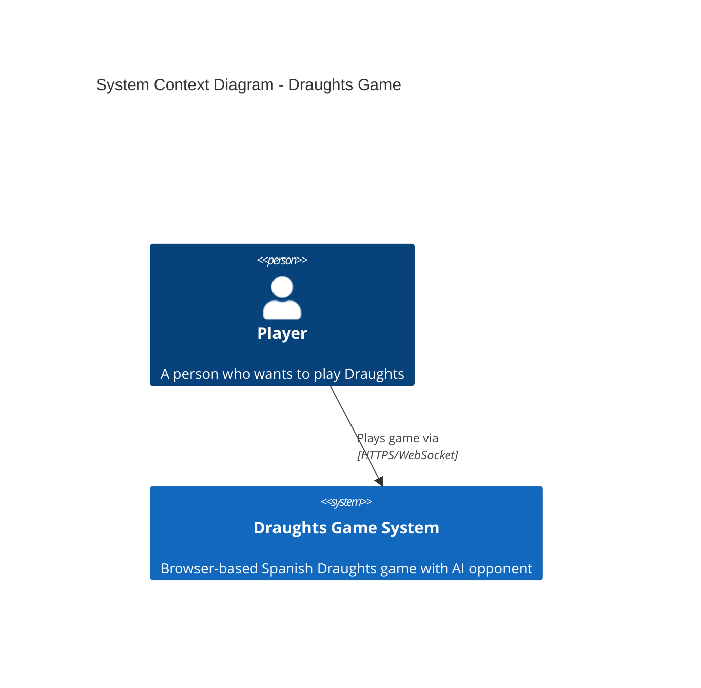

### Key Actors

| Actor | Description | Interactions |
|-------|-------------|--------------|
| Player | Human user playing the game | Interacts with UI, makes moves, starts new games |

### External Systems

None - This is a standalone MVP with no external integrations.

---

## Container Architecture

The system is composed of multiple containers orchestrated by .NET Aspire:

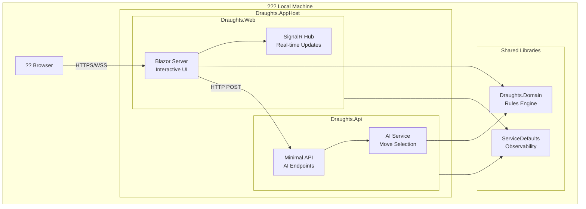

### Container Descriptions

| Container | Technology | Purpose | Port (Dev) |
|-----------|------------|---------|------------|
| **Draughts.AppHost** | .NET Aspire | Orchestration, service discovery, dashboard | Dynamic |
| **Draughts.Web** | Blazor Server | Game UI, user interaction, local rules validation | HTTPS |
| **Draughts.Api** | Minimal API | AI move computation endpoint | HTTPS |
| **Draughts.Domain** | Class Library | Pure domain logic, rules engine | N/A |
| **ServiceDefaults** | Class Library | Shared Aspire configurations | N/A |

---

## Component Architecture

### Draughts.Web Components

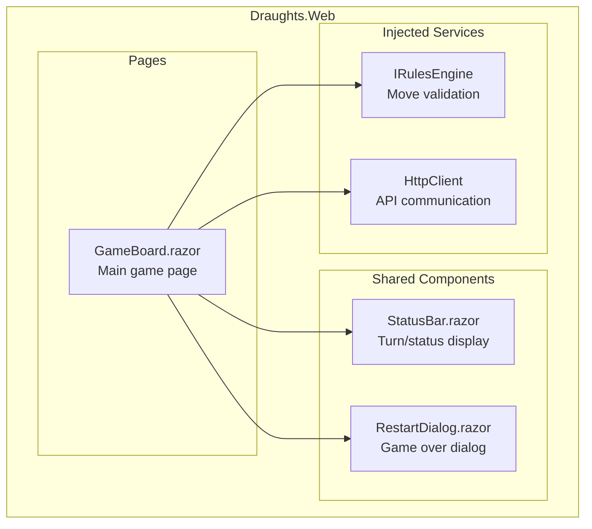

### Draughts.Api Components

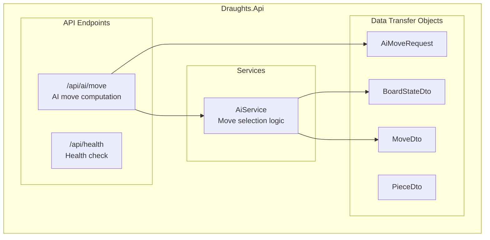

### Draughts.Domain Components

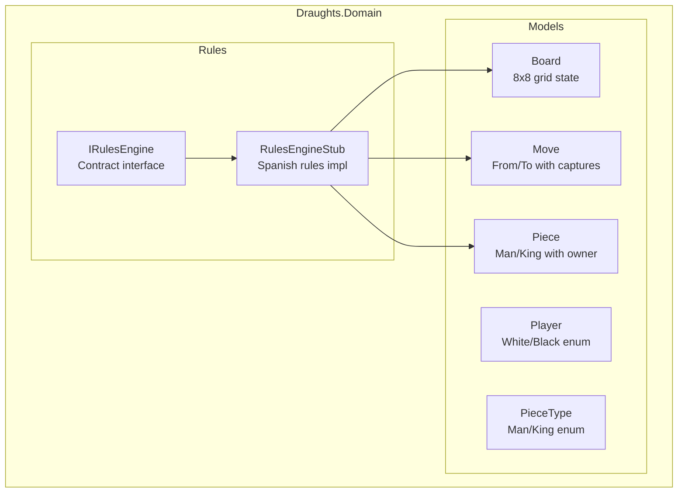

---

## Data Flow

### Player Move Sequence

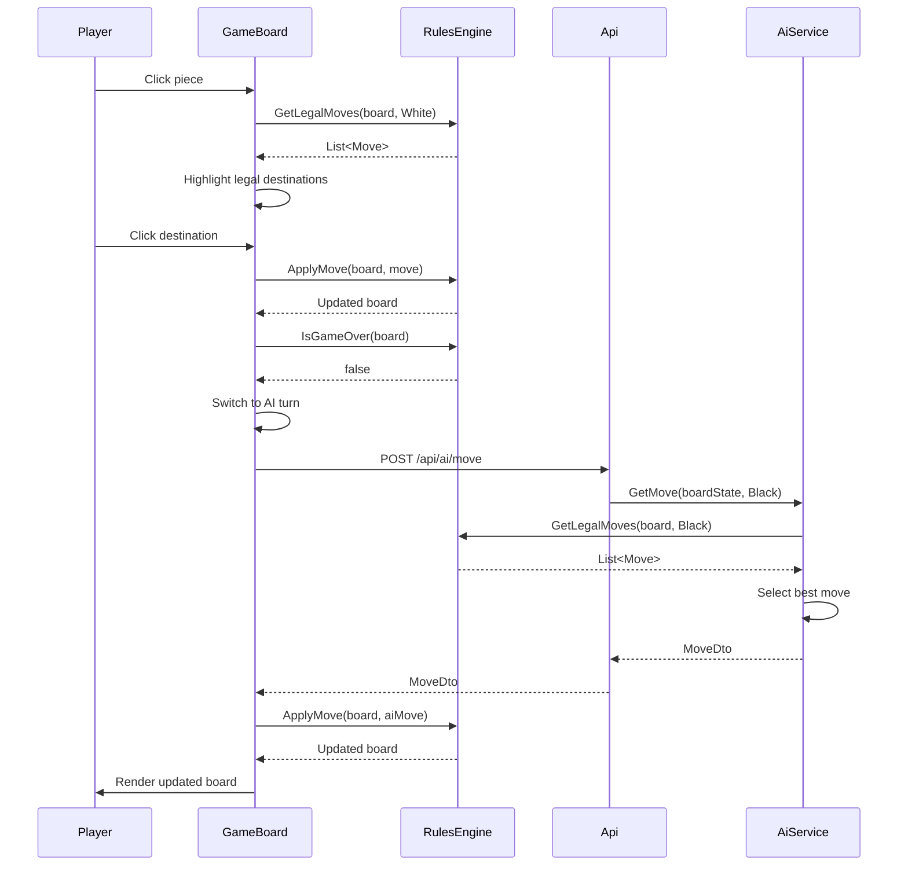

### Game State Lifecycle

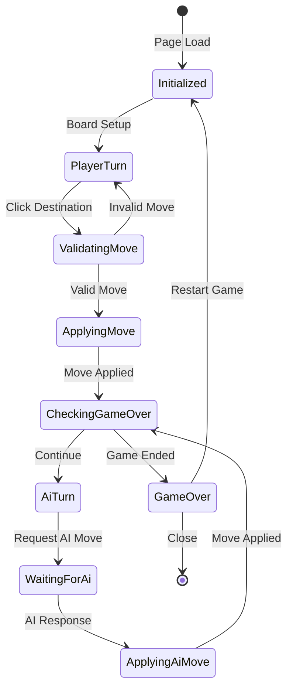

---

## Technology Decisions

### Architecture Style: Clean Architecture

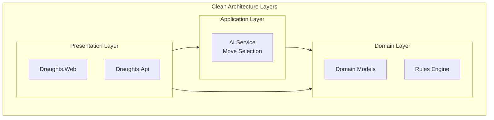

### Key Decisions

| Decision | Choice | Rationale |
|----------|--------|-----------|
| **UI Framework** | Blazor Server | Rich interactivity, server-side state, SignalR real-time updates |
| **API Style** | Minimal APIs | Lightweight, fast, sufficient for single endpoint |
| **Orchestration** | .NET Aspire | Service discovery, health checks, observability out-of-box |
| **State Management** | In-Memory | MVP scope, no persistence requirement |
| **Rules Engine** | Pure Domain Service | Testable, framework-agnostic, reusable |

### Dependency Direction

```
Draughts.AppHost
    ??? Draughts.Web
    ?   ??? Draughts.Domain
    ?   ??? Draughts.ServiceDefaults
    ??? Draughts.Api
        ??? Draughts.Domain
        ??? Draughts.ServiceDefaults
```

---

## Cross-Cutting Concerns

### Observability

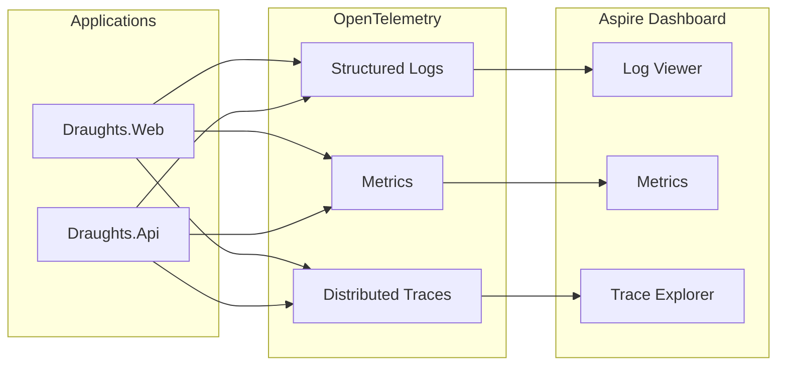

### Service Defaults Configuration

The `ServiceDefaults` project provides shared configuration:

| Feature | Description |
|---------|-------------|
| **Health Checks** | `/health` and `/alive` endpoints |
| **Service Discovery** | Automatic endpoint resolution |
| **Resilience** | Standard HTTP client retry policies |
| **OpenTelemetry** | Logging, metrics, and tracing |

### Security Model

| Aspect | Implementation | Notes |
|--------|----------------|-------|
| Authentication | None | MVP single-player |
| Authorization | None | No roles required |
| HTTPS | Required | Development certificates |
| CORS | Development policy | AllowAnyOrigin for local dev |
| Input Validation | API-level | Board state validation |

---

## Deployment Model

### Development Environment

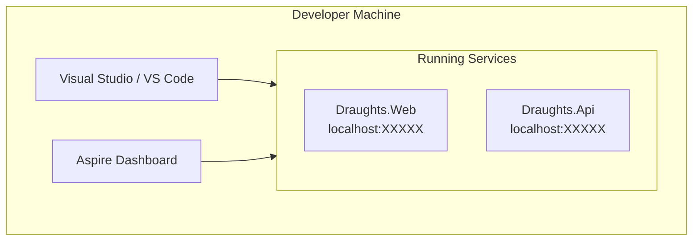

### Running the Application

```bash
# Option 1: Aspire orchestration (recommended)
dotnet run --project src/Draughts.AppHost

# Option 2: Individual projects
dotnet run --project src/Draughts.Api &
dotnet run --project src/Draughts.Web
```

---

## Future Considerations

### Potential Enhancements

1. **Multiplayer Support** - Add SignalR hub for real-time games
2. **Persistence** - Add PostgreSQL for game history
3. **AI Improvements** - Implement minimax with alpha-beta pruning
4. **Cloud Deployment** - Azure Container Apps with Aspire

### Scalability Path

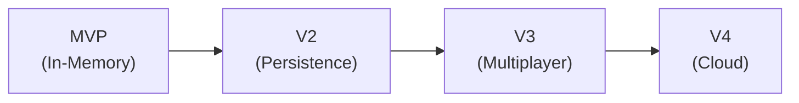

---

*See also: [Code Overview](code-overview.md) | [API Reference](api-reference.md) | [Domain Model](domain-model.md)*
