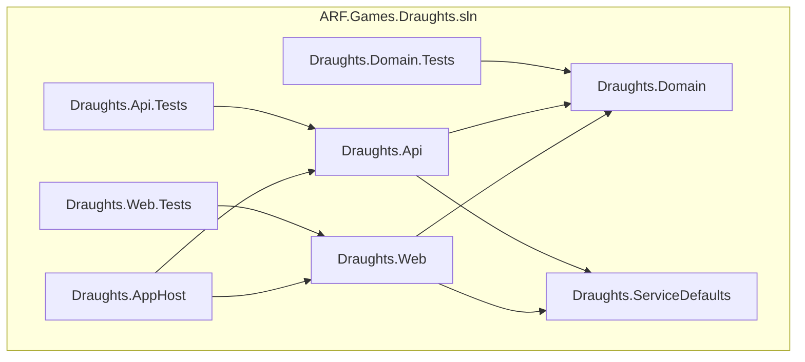

# Code Overview

> **Document Type:** Technical Reference  
> **Version:** 1.0.0  
> **Last Updated:** 2025

## Table of Contents

- [Solution Structure](#solution-structure)
- [Project Dependencies](#project-dependencies)
- [Key Namespaces](#key-namespaces)
- [Core Classes](#core-classes)
- [Configuration](#configuration)
- [Testing Structure](#testing-structure)

---

## Solution Structure

```
ARF.Games/
??? ?? src/
?   ??? ?? Draughts.AppHost/          # .NET Aspire orchestrator
?   ?   ??? AppHost.cs                 # Service composition
?   ?
?   ??? ?? Draughts.Web/               # Blazor Server frontend
?   ?   ??? ?? Pages/
?   ?   ?   ??? GameBoard.razor        # Main game UI
?   ?   ??? ?? Shared/
?   ?   ?   ??? StatusBar.razor        # Turn indicator
?   ?   ?   ??? RestartDialog.razor    # Game over dialog
?   ?   ??? ?? wwwroot/
?   ?   ?   ??? ?? css/
?   ?   ?       ??? game.css           # Game styling
?   ?   ??? Program.cs                 # Web host configuration
?   ?
?   ??? ?? Draughts.Api/               # Minimal API backend
?   ?   ??? ?? Dto/
?   ?   ?   ??? AiMoveRequest.cs       # AI request contract
?   ?   ?   ??? BoardStateDto.cs       # Board state transfer
?   ?   ?   ??? MoveDto.cs             # Move response
?   ?   ?   ??? PieceDto.cs            # Piece representation
?   ?   ??? ?? Services/
?   ?   ?   ??? AiService.cs           # AI move selection
?   ?   ??? ?? Mappers/
?   ?   ?   ??? BoardMapper.cs         # DTO mappings
?   ?   ??? Program.cs                 # API host configuration
?   ?
?   ??? ?? Draughts.Domain/            # Domain layer (pure C#)
?   ?   ??? ?? Models/
?   ?   ?   ??? Board.cs               # Game board state
?   ?   ?   ??? Piece.cs               # Piece + enums
?   ?   ?   ??? Move.cs                # Move representation
?   ?   ??? ?? Rules/
?   ?   ?   ??? RulesEngineStub.cs     # Spanish rules impl
?   ?   ??? IRulesEngine.cs            # Rules contract
?   ?
?   ??? ?? Draughts.ServiceDefaults/   # Shared Aspire config
?       ??? Extensions.cs              # Service registration
?
??? ?? tests/
?   ??? ?? Draughts.Domain.Tests/      # Domain unit tests
?   ?   ??? RulesEngineTests.cs
?   ??? ?? Draughts.Api.Tests/         # API integration tests
?   ??? ?? Draughts.Web.Tests/         # UI component tests
?
??? ?? docs/
?   ??? ?? 001-mvp/                    # MVP iteration docs
?   ?   ??? ?? SOR/                    # Statement of Requirements
?   ?   ??? ?? specs/                  # Technical specifications
?   ?   ??? ?? plans/                  # Build plans
?   ??? ?? technical/                  # Technical documentation
?
??? ?? .github/
    ??? copilot-instructions.md        # AI coding guidelines
```

---

## Project Dependencies



### Package References by Project

#### Draughts.AppHost
```xml
<PackageReference Include="Aspire.Hosting.AppHost" />
```

#### Draughts.Web
```xml
<PackageReference Include="Microsoft.AspNetCore.Components.Web" />
<ProjectReference Include="..\Draughts.Domain\Draughts.Domain.csproj" />
<ProjectReference Include="..\Draughts.ServiceDefaults\Draughts.ServiceDefaults.csproj" />
```

#### Draughts.Api
```xml
<PackageReference Include="Microsoft.AspNetCore.OpenApi" />
<ProjectReference Include="..\Draughts.Domain\Draughts.Domain.csproj" />
<ProjectReference Include="..\Draughts.ServiceDefaults\Draughts.ServiceDefaults.csproj" />
```

#### Draughts.ServiceDefaults
```xml
<PackageReference Include="Microsoft.Extensions.Http.Resilience" />
<PackageReference Include="Microsoft.Extensions.ServiceDiscovery" />
<PackageReference Include="OpenTelemetry.Exporter.OpenTelemetryProtocol" />
<PackageReference Include="OpenTelemetry.Extensions.Hosting" />
<PackageReference Include="OpenTelemetry.Instrumentation.AspNetCore" />
<PackageReference Include="OpenTelemetry.Instrumentation.Http" />
<PackageReference Include="OpenTelemetry.Instrumentation.Runtime" />
```

---

## Key Namespaces

| Namespace | Description | Location |
|-----------|-------------|----------|
| `Draughts.Domain.Models` | Core domain entities (Board, Piece, Move) | `src/Draughts.Domain/Models/` |
| `Draughts.Domain.Rules` | Rules engine implementations | `src/Draughts.Domain/Rules/` |
| `Draughts.Domain` | Domain contracts (IRulesEngine) | `src/Draughts.Domain/` |
| `Draughts.Api.Dto` | API data transfer objects | `src/Draughts.Api/Dto/` |
| `Draughts.Api.Services` | API business services | `src/Draughts.Api/Services/` |
| `Microsoft.Extensions.Hosting` | ServiceDefaults extensions | `src/Draughts.ServiceDefaults/` |

---

## Core Classes

### Domain Layer

#### `Board` - Game State Container

```csharp
namespace Draughts.Domain.Models;

public class Board
{
    public const int Size = 8;                    // 8x8 board
    private readonly Piece?[,] _cells;            // Cell storage
    
    public Piece? Get(int row, int col);          // Get piece at position
    public void Set(int row, int col, Piece?);   // Set piece at position
    public static Board CreateInitial();          // Factory method
}
```

**Board Coordinate System:**
```
    Col: 0   1   2   3   4   5   6   7
Row 0:  ?   ?   ?   ?   ?   ?   ?   ?    ? Black pieces (rows 0-2)
Row 1:  ?   ?   ?   ?   ?   ?   ?   ?
Row 2:  ?   ?   ?   ?   ?   ?   ?   ?
Row 3:  ?   ?   ?   ?   ?   ?   ?   ?    ? Empty rows (3-4)
Row 4:  ?   ?   ?   ?   ?   ?   ?   ?
Row 5:  ?   ?   ?   ?   ?   ?   ?   ?    ? White pieces (rows 5-7)
Row 6:  ?   ?   ?   ?   ?   ?   ?   ?
Row 7:  ?   ?   ?   ?   ?   ?   ?   ?

? = Light square (unused in draughts)
? = Dark square (playable)
```

#### `Piece` - Game Piece

```csharp
namespace Draughts.Domain.Models;

public enum Player { White, Black }
public enum PieceType { Man, King }

public record Piece(Player Owner, PieceType Type);
```

#### `Move` - Movement Representation

```csharp
namespace Draughts.Domain.Models;

public record Move(
    int FromRow, int FromCol,           // Origin
    int ToRow, int ToCol,               // Destination
    IReadOnlyList<(int Row, int Col)>? CapturedPositions = null
)
{
    public bool IsCapture => CapturedPositions is { Count: > 0 };
    
    public static Move Simple(int fromRow, int fromCol, int toRow, int toCol);
    public static Move Capture(int fromRow, int fromCol, int toRow, int toCol, 
                               params (int Row, int Col)[] captured);
}
```

#### `IRulesEngine` - Rules Contract

```csharp
namespace Draughts.Domain;

public interface IRulesEngine
{
    IEnumerable<Move> GetLegalMoves(Board board, Player player);
    Board ApplyMove(Board board, Move move);
    bool IsGameOver(Board board);
}
```

#### `RulesEngineStub` - Spanish Rules Implementation

```csharp
namespace Draughts.Domain.Rules;

public class RulesEngineStub : IRulesEngine
{
    // Implements Spanish draughts rules:
    // - Mandatory capture enforcement
    // - Multi-capture chains
    // - Flying king movement
    // - Man forward-only movement
    // - Promotion at back row
}
```

### API Layer

#### `AiService` - AI Move Selection

```csharp
namespace Draughts.Api.Services;

public interface IAiService
{
    MoveDto? GetMove(BoardStateDto boardState, Player player);
}

public class AiService : IAiService
{
    // AI Strategy:
    // 1. Get all legal moves from rules engine
    // 2. Prefer captures (mandatory in Spanish rules)
    // 3. Select longest capture chain
    // 4. Random selection among equal options
}
```

#### DTOs - Data Transfer Objects

```csharp
namespace Draughts.Api.Dto;

public record AiMoveRequest(BoardStateDto Board, string Player);
public record BoardStateDto(IEnumerable<PieceDto>? Pieces);
public record PieceDto(int Row, int Col, string Owner, string Type);
public record MoveDto(int FromRow, int FromCol, int ToRow, int ToCol, 
                      List<CapturedPositionDto>? CapturedPositions = null);
public record CapturedPositionDto(int Row, int Col);
```

### Web Layer

#### `GameBoard.razor` - Main Game Component

```csharp
@page "/"
@code {
    // State
    private Board _board;                    // Current game state
    private Player _currentPlayer;           // Active player
    private int? _selectedRow, _selectedCol; // Selected piece
    private List<Move> _legalMoves;          // Valid destinations
    private bool _gameOver, _mustCapture;    // Game flags
    
    // Lifecycle
    protected override void OnInitialized();
    private void InitializeBoard();
    
    // Interaction
    private void OnCellClick(int row, int col);
    private void SelectPiece(int row, int col);
    private void ApplyPlayerMove(Move move);
    
    // AI
    private async Task RequestAiMoveAsync();
    
    // Game Logic
    private bool CheckGameOver();
    private void RestartGame();
}
```

---

## Configuration

### AppHost Configuration (`AppHost.cs`)

```csharp
var builder = DistributedApplication.CreateBuilder(args);

var API = builder.AddProject<Projects.Draughts_Api>("draughts-api");

var Web = builder.AddProject<Projects.Draughts_Web>("draughts-web")
    .WithReference(API)    // Service discovery
    .WaitFor(API);         // Startup ordering

builder.Build().Run();
```

### Web Configuration (`Program.cs`)

```csharp
var builder = WebApplication.CreateBuilder(args);

builder.AddServiceDefaults();                    // Aspire integration
builder.Services.AddRazorPages();
builder.Services.AddServerSideBlazor();

// Domain services
builder.Services.AddSingleton<IRulesEngine, RulesEngineStub>();

// HTTP client for API calls
builder.Services.AddHttpClient("DraughtsApi", client =>
{
    client.BaseAddress = new Uri("https://localhost:62588");
});
```

### API Configuration (`Program.cs`)

```csharp
var builder = WebApplication.CreateBuilder(args);

builder.AddServiceDefaults();                    // Aspire integration
builder.Services.AddCors(...);                   // CORS policy

// Domain services
builder.Services.AddSingleton<IRulesEngine, RulesEngineStub>();
builder.Services.AddScoped<IAiService, AiService>();

// Endpoints
app.MapGet("/api/health", () => Results.Ok(...));
app.MapPost("/api/ai/move", (request, ai, logger) => ...);
```

### Service Defaults (`Extensions.cs`)

```csharp
public static TBuilder AddServiceDefaults<TBuilder>(this TBuilder builder)
{
    builder.ConfigureOpenTelemetry();     // Logging, metrics, traces
    builder.AddDefaultHealthChecks();     // /health, /alive endpoints
    builder.Services.AddServiceDiscovery();
    builder.Services.ConfigureHttpClientDefaults(http =>
    {
        http.AddStandardResilienceHandler();
        http.AddServiceDiscovery();
    });
    return builder;
}
```

---

## Testing Structure

### Test Projects

| Project | Type | Framework | Purpose |
|---------|------|-----------|---------|
| `Draughts.Domain.Tests` | Unit | xUnit | Rules engine logic |
| `Draughts.Api.Tests` | Integration | xUnit | API endpoints |
| `Draughts.Web.Tests` | Component | bUnit | Blazor components |

### Example Test

```csharp
namespace Draughts.Domain.Tests;

public class RulesEngineTests
{
    private readonly RulesEngineStub _engine = new();

    [Fact]
    public void ManCapture_WhenOpponentAdjacent_ReturnsOnlyCaptureMove()
    {
        // Arrange
        var board = new Board();
        board.Set(5, 2, new Piece(Player.White, PieceType.Man));
        board.Set(4, 3, new Piece(Player.Black, PieceType.Man));

        // Act
        var moves = _engine.GetLegalMoves(board, Player.White).ToList();

        // Assert
        Assert.Single(moves);
        Assert.True(moves[0].IsCapture);
    }
}
```

### Running Tests

```bash
# All tests
dotnet test

# Specific project
dotnet test tests/Draughts.Domain.Tests

# With coverage
dotnet-coverage collect -f cobertura -o coverage.xml dotnet test
```

---

## Code Conventions

### Naming Conventions

| Element | Convention | Example |
|---------|------------|---------|
| Namespace | PascalCase, hierarchical | `Draughts.Domain.Models` |
| Class/Record | PascalCase | `RulesEngineStub` |
| Interface | I + PascalCase | `IRulesEngine` |
| Method | PascalCase | `GetLegalMoves` |
| Private field | _camelCase | `_board` |
| Parameter | camelCase | `boardState` |
| Constant | PascalCase | `Board.Size` |

### File Organization

- One primary type per file
- File name matches type name
- Tests mirror source structure

### Async Patterns

```csharp
// ? Correct: Async suffix, await properly
private async Task RequestAiMoveAsync()
{
    await Task.Delay(500);
    var response = await Http.PostAsJsonAsync("/api/ai/move", request);
    // ...
    StateHasChanged();
}

// ? Avoid: Fire-and-forget without handling
_ = RequestAiMoveAsync();  // Used intentionally for UI responsiveness
```

---

*See also: [Architecture Overview](architecture.md) | [API Reference](api-reference.md) | [Domain Model](domain-model.md)*
