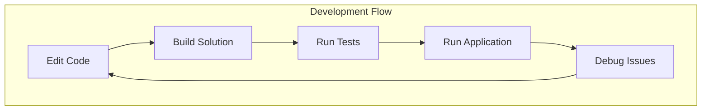
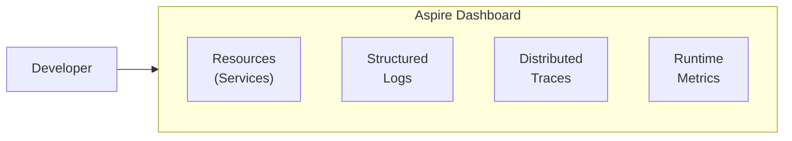

# Development Guide

> **Document Type:** Developer Documentation  
> **Version:** 1.0.0  
> **Last Updated:** 2025

## Table of Contents

- [Prerequisites](#prerequisites)
- [Getting Started](#getting-started)
- [Development Workflow](#development-workflow)
- [Building and Running](#building-and-running)
- [Testing](#testing)
- [Debugging](#debugging)
- [Code Style](#code-style)
- [Contributing](#contributing)
- [Troubleshooting](#troubleshooting)

---

## Prerequisites

### Required Software

| Software | Version | Purpose |
|----------|---------|---------|
| .NET SDK | 10.0+ | Build and run |
| Visual Studio 2026 | 17.12+ | IDE (recommended) |
| VS Code | Latest | Alternative IDE |
| Git | 2.x+ | Version control |

### .NET Workloads

```bash
# Install required workloads
dotnet workload install aspire
```

### Verify Installation

```bash
# Check .NET version
dotnet --version
# Expected: 10.0.x

# Check workloads
dotnet workload list
# Should include: aspire
```

---

## Getting Started

### Clone Repository

```bash
git clone https://github.com/alexanderfewtrell/ARF.Games.Draughts.git
cd ARF.Games
```

### Restore Dependencies

```bash
dotnet restore
```

### Trust Development Certificates

```bash
dotnet dev-certs https --trust
```

### Quick Start

```bash
# Run with Aspire orchestration (recommended)
dotnet run --project src/Draughts.AppHost

# Open in browser
# - Aspire Dashboard: https://localhost:xxxxx (shown in console)
# - Game UI: https://localhost:xxxxx (shown in dashboard)
```

---

## Development Workflow

### Project Structure Overview



### Recommended IDE Setup

#### Visual Studio 2022

1. Open `ARF.Games.sln`
2. Set `Draughts.AppHost` as startup project
3. Press F5 to start debugging

#### VS Code

1. Install C# Dev Kit extension
2. Open folder in VS Code
3. Use terminal to run commands

### Hot Reload

Blazor Server supports hot reload during development:

1. Run application with `dotnet watch`
2. Edit `.razor` or `.css` files
3. Changes apply automatically

```bash
# With hot reload
dotnet watch --project src/Draughts.Web
```

---

## Building and Running

### Build Commands

```bash
# Build entire solution
dotnet build

# Build specific project
dotnet build src/Draughts.Web

# Build in Release mode
dotnet build -c Release

# Clean and rebuild
dotnet clean && dotnet build
```

### Run Commands

```bash
# Option 1: Aspire orchestration (recommended)
dotnet run --project src/Draughts.AppHost

# Option 2: Individual services
# Terminal 1:
dotnet run --project src/Draughts.Api
# Terminal 2:
dotnet run --project src/Draughts.Web

# Option 3: With watch for development
dotnet watch --project src/Draughts.AppHost
```

### Aspire Dashboard

When running with AppHost, the Aspire Dashboard provides:



| Feature | Description |
|---------|-------------|
| Resources | View running services and their status |
| Logs | Real-time structured log viewer |
| Traces | Distributed tracing for requests |
| Metrics | Application performance metrics |

---

## Testing

### Test Structure

```
tests/
├── Draughts.Domain.Tests/     # Unit tests
│   └── RulesEngineTests.cs
├── Draughts.Api.Tests/        # Integration tests
└── Draughts.Web.Tests/        # Component tests
```

### Running Tests

```bash
# Run all tests
dotnet test

# Run specific project
dotnet test tests/Draughts.Domain.Tests

# Run with verbosity
dotnet test -v normal

# Run specific test
dotnet test --filter "RulesEngineTests"

# Run with coverage
dotnet-coverage collect -f cobertura -o coverage.xml dotnet test
```

### Test Categories

#### Domain Unit Tests

```csharp
public class RulesEngineTests
{
    [Fact]
    public void ManCapture_WhenOpponentAdjacent_ReturnsOnlyCaptureMove()
    {
        // Arrange
        var board = new Board();
        board.Set(5, 2, new Piece(Player.White, PieceType.Man));
        board.Set(4, 3, new Piece(Player.Black, PieceType.Man));

        // Act
        var moves = _engine.GetLegalMoves(board, Player.White).ToList();

        // Assert
        Assert.Single(moves);
        Assert.True(moves[0].IsCapture);
    }
}
```

#### API Integration Tests

```csharp
public class AiMoveEndpointTests
{
    [Fact]
    public async Task PostAiMove_WithValidBoard_ReturnsMove()
    {
        // Use WebApplicationFactory for integration testing
    }
}
```

#### Blazor Component Tests (bUnit)

```csharp
public class GameBoardTests
{
    [Fact]
    public void GameBoard_OnInitialized_RendersBoardWithPieces()
    {
        // Use bUnit for component testing
    }
}
```

### Writing Tests

Follow these conventions:

| Convention | Example |
|------------|---------|
| Class naming | `{ClassUnderTest}Tests` |
| Method naming | `{Method}_When{Condition}_Then{Outcome}` |
| Structure | Arrange-Act-Assert (AAA) |
| One assertion | Single behavior per test |

---

## Debugging

### Visual Studio Debugging

1. Set breakpoints in code
2. Press F5 or click "Start Debugging"
3. Use Debug toolbar and windows

### Launch Configurations

The solution includes launch configurations for:

| Profile | Project | Purpose |
|---------|---------|---------|
| AppHost | Draughts.AppHost | Full stack with Aspire |
| Web | Draughts.Web | UI only |
| Api | Draughts.Api | API only |

### Debug Logging

Enable detailed logging in `appsettings.Development.json`:

```json
{
  "Logging": {
    "LogLevel": {
      "Default": "Debug",
      "Microsoft.AspNetCore": "Warning",
      "Draughts": "Debug"
    }
  }
}
```

### Common Debug Scenarios

#### Debugging Rules Engine

```csharp
// Add breakpoint in RulesEngineStub.GetLegalMoves
var captures = GetAllCaptures(board, player).ToList();
// Inspect 'captures' in debugger
```

#### Debugging AI Service

```csharp
// Add breakpoint in AiService.GetMove
var moves = _rules.GetLegalMoves(board, player).ToList();
// Inspect available moves
```

#### Debugging Blazor Components

```csharp
// Add breakpoint in GameBoard.razor @code block
private void OnCellClick(int row, int col)
{
    // Inspect state here
}
```

---

## Code Style

### General Conventions

| Element | Convention | Example |
|---------|------------|---------|
| Namespace | PascalCase | `Draughts.Domain.Models` |
| Class | PascalCase | `RulesEngineStub` |
| Interface | I + PascalCase | `IRulesEngine` |
| Method | PascalCase | `GetLegalMoves` |
| Private field | _camelCase | `_board` |
| Local variable | camelCase | `legalMoves` |
| Constant | PascalCase | `Board.Size` |

### C# 14 Features Used

```csharp
// Records for immutable types
public record Piece(Player Owner, PieceType Type);

// Pattern matching
if (piece is { Type: PieceType.King })

// File-scoped namespaces
namespace Draughts.Domain.Models;

// Collection expressions
var moves = [];

// Primary constructors
public class AiService(IRulesEngine rules)
```

### Code Analysis

The solution uses analyzers for code quality:

```bash
# Check for warnings
dotnet build -warnaserror
```

### EditorConfig

The repository includes `.editorconfig` for consistent formatting:

```ini
# Example settings
indent_style = space
indent_size = 4
end_of_line = crlf
```

---

## Contributing

### Branch Strategy

```mermaid
gitgraph
    commit id: "main"
    branch feature/add-feature
    commit id: "feature work"
    commit id: "tests"
    checkout main
    merge feature/add-feature
```

| Branch | Purpose |
|--------|---------|
| `main` | Production-ready code |
| `feature/*` | New features |
| `fix/*` | Bug fixes |
| `docs/*` | Documentation updates |

### Pull Request Process

1. Create feature branch from `main`
2. Implement changes with tests
3. Ensure all tests pass
4. Update documentation if needed
5. Create pull request
6. Address review feedback
7. Merge when approved

### Commit Messages

```
type(scope): description

[optional body]

[optional footer]
```

| Type | Purpose |
|------|---------|
| `feat` | New feature |
| `fix` | Bug fix |
| `docs` | Documentation |
| `test` | Tests |
| `refactor` | Code refactoring |

Example:
```
feat(domain): add multi-capture chain support

Implements recursive capture detection for Spanish draughts rules.
Fixes #42
```

---

## Troubleshooting

### Common Issues

#### HTTPS Certificate Errors

```bash
# Trust the development certificate
dotnet dev-certs https --trust

# If issues persist, clean and regenerate
dotnet dev-certs https --clean
dotnet dev-certs https --trust
```

#### Port Conflicts

```bash
# Check for processes using ports
netstat -ano | findstr :5000

# Kill process if needed
taskkill /PID <pid> /F
```

#### Build Failures

```bash
# Clean solution
dotnet clean

# Restore packages
dotnet restore

# Rebuild
dotnet build
```

#### Aspire Dashboard Not Loading

1. Check console output for dashboard URL
2. Ensure Aspire workload is installed
3. Try running AppHost directly

```bash
dotnet workload repair
dotnet run --project src/Draughts.AppHost
```

#### Hot Reload Not Working

```bash
# Ensure using watch mode
dotnet watch --project src/Draughts.Web

# Check for unsupported changes (some require restart)
```

### Getting Help

| Resource | Link |
|----------|------|
| GitHub Issues | Create issue in repository |
| .NET Aspire Docs | https://learn.microsoft.com/dotnet/aspire |
| Blazor Docs | https://learn.microsoft.com/aspnet/core/blazor |

### Logs Location

| Log Type | Location |
|----------|----------|
| Console | Terminal output |
| Aspire Dashboard | https://localhost:xxxxx |
| Application Insights | (Not configured for MVP) |

---

## Quick Reference

### Essential Commands

```bash
# Build
dotnet build

# Test
dotnet test

# Run (Aspire)
dotnet run --project src/Draughts.AppHost

# Run (Watch mode)
dotnet watch --project src/Draughts.AppHost

# Clean
dotnet clean
```

### Project Ports (Development)

| Service | Protocol | Port |
|---------|----------|------|
| Draughts.Web | HTTPS | Dynamic (see console) |
| Draughts.Api | HTTPS | Dynamic (see console) |
| Aspire Dashboard | HTTPS | Dynamic (see console) |

### Key Files

| File | Purpose |
|------|---------|
| `AppHost.cs` | Service orchestration |
| `GameBoard.razor` | Main game UI |
| `RulesEngineStub.cs` | Game rules |
| `AiService.cs` | AI logic |
| `Extensions.cs` | Aspire defaults |

---

*See also: [Architecture Overview](architecture.md) | [Code Overview](code-overview.md) | [API Reference](api-reference.md)*
