# Domain Model

> **Document Type:** Domain Documentation  
> **Version:** 1.0.0  
> **Last Updated:** 2025

## Table of Contents

- [Overview](#overview)
- [Domain Entities](#domain-entities)
- [Rules Engine](#rules-engine)
- [Spanish Draughts Rules](#spanish-draughts-rules)
- [Game Flow](#game-flow)
- [AI Strategy](#ai-strategy)

---

## Overview

The domain layer (`Draughts.Domain`) encapsulates all game logic for Spanish Draughts. It is designed as a pure domain model with no framework dependencies, making it highly testable and reusable across both the Web and API projects.

### Design Principles

| Principle | Implementation |
|-----------|----------------|
| **Pure Functions** | Rules engine methods are deterministic |
| **Immutable Records** | `Piece` and `Move` are immutable records |
| **Separation of Concerns** | Domain has no UI/API dependencies |
| **Interface-Based** | `IRulesEngine` allows future rule variants |

### Domain Class Diagram

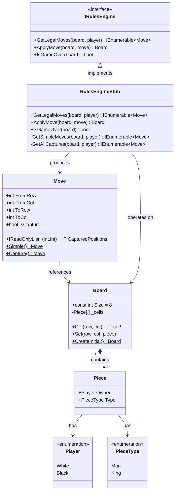

---

## Domain Entities

### Board

The `Board` class represents the 8x8 game grid and manages piece positions.

```csharp
public class Board
{
    public const int Size = 8;
    private readonly Piece?[,] _cells = new Piece?[Size, Size];

    public Piece? Get(int row, int col);
    public void Set(int row, int col, Piece? piece);
    public static Board CreateInitial();
}
```

#### Board Layout

```mermaid
graph TB
    subgraph Board["8x8 Spanish Draughts Board"]
        subgraph Row0["Row 0 (Black Back)"]
            C01["?"] --- C03["?"] --- C05["?"] --- C07["?"]
        end
        subgraph Row1["Row 1"]
            C10["?"] --- C12["?"] --- C14["?"] --- C16["?"]
        end
        subgraph Row2["Row 2 (Black Front)"]
            C21["?"] --- C23["?"] --- C25["?"] --- C27["?"]
        end
        subgraph Row34["Rows 3-4 (Empty)"]
            Empty["No pieces"]
        end
        subgraph Row5["Row 5 (White Front)"]
            C50["?"] --- C52["?"] --- C54["?"] --- C56["?"]
        end
        subgraph Row6["Row 6"]
            C61["?"] --- C63["?"] --- C65["?"] --- C67["?"]
        end
        subgraph Row7["Row 7 (White Back)"]
            C70["?"] --- C72["?"] --- C74["?"] --- C76["?"]
        end
    end
```

#### Coordinate System

| Property | Value | Description |
|----------|-------|-------------|
| Rows | 0-7 | Top to bottom |
| Columns | 0-7 | Left to right |
| Playable squares | Dark only | `(row + col) % 2 == 1` |
| Black start | Rows 0-2 | Top of board |
| White start | Rows 5-7 | Bottom of board |

### Piece

A `Piece` represents a game piece with owner and type.

```csharp
public record Piece(Player Owner, PieceType Type);
```

#### Enumerations

```csharp
public enum Player
{
    White,  // Human player (moves first)
    Black   // AI opponent
}

public enum PieceType
{
    Man,    // Regular piece, forward movement only
    King    // Promoted piece, any diagonal direction
}
```

### Move

A `Move` represents a movement from one position to another, optionally capturing pieces.

```csharp
public record Move(
    int FromRow, int FromCol,
    int ToRow, int ToCol,
    IReadOnlyList<(int Row, int Col)>? CapturedPositions = null
)
{
    public bool IsCapture => CapturedPositions is { Count: > 0 };
    
    public static Move Simple(int fromRow, int fromCol, int toRow, int toCol);
    public static Move Capture(int fromRow, int fromCol, int toRow, int toCol, 
                               params (int Row, int Col)[] captured);
}
```

#### Move Types

| Type | Factory Method | Description |
|------|---------------|-------------|
| Simple Move | `Move.Simple()` | Non-capturing diagonal move |
| Capture Move | `Move.Capture()` | Jump over opponent, remove piece |
| Multi-Capture | `Move.Capture()` with multiple positions | Chain of captures |

---

## Rules Engine

### Interface Contract

```csharp
public interface IRulesEngine
{
    /// <summary>
    /// Returns all legal moves for the specified player.
    /// When captures are available, only capture moves are returned (mandatory capture).
    /// </summary>
    IEnumerable<Move> GetLegalMoves(Board board, Player player);
    
    /// <summary>
    /// Applies a move to the board and returns the updated board state.
    /// Handles captures, promotions to King, and multi-capture chains.
    /// </summary>
    Board ApplyMove(Board board, Move move);
    
    /// <summary>
    /// Checks if the game is over (no legal moves for either player).
    /// </summary>
    bool IsGameOver(Board board);
}
```

### Implementation: RulesEngineStub

The `RulesEngineStub` implements Spanish Draughts rules:

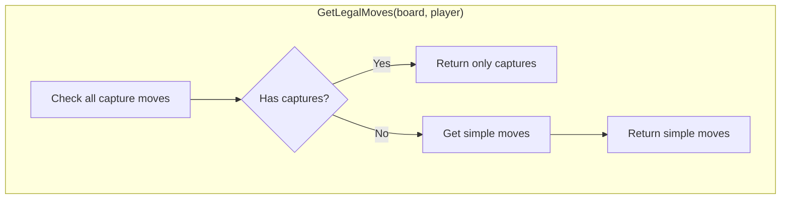

---

## Spanish Draughts Rules

### Movement Rules

#### Man (Regular Piece)

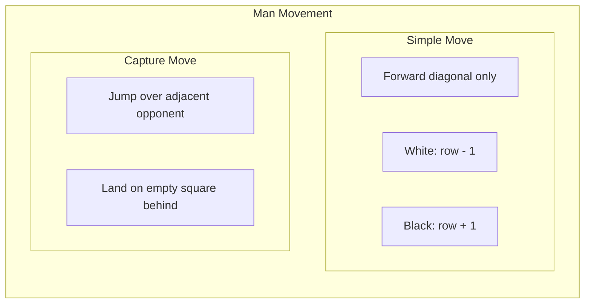

| Rule | Description |
|------|-------------|
| Direction | Forward only (White moves up, Black moves down) |
| Distance | One square diagonally |
| Capture | Jump over adjacent opponent to empty square behind |

#### King (Promoted Piece)

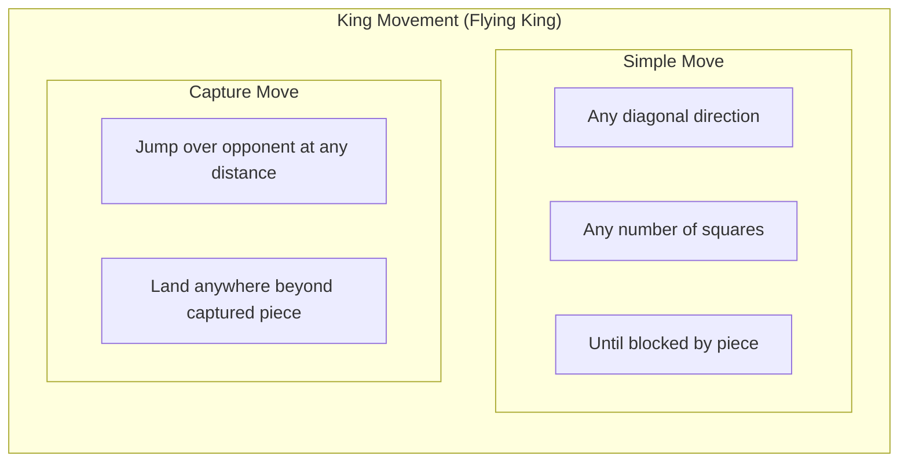

| Rule | Description |
|------|-------------|
| Direction | Any diagonal direction |
| Distance | Any number of empty squares |
| Capture | Jump over opponent, land on any empty square beyond |

### Promotion Rules

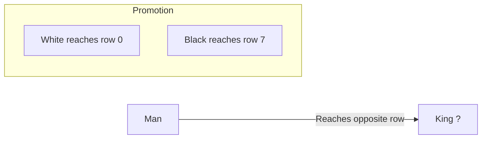

| Player | Promotion Row | Visual |
|--------|---------------|--------|
| White | Row 0 (top) | `?` ? `?` |
| Black | Row 7 (bottom) | `?` ? `?` |

### Mandatory Capture

Spanish Draughts enforces **mandatory capture**:

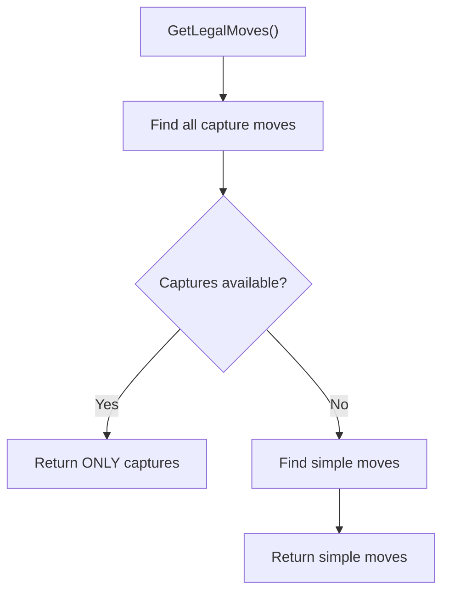

**Key Points:**
- If any capture is possible, the player MUST capture
- Cannot make a simple move when capture is available
- Must complete entire multi-capture chain

### Multi-Capture Chains

When multiple captures are possible in sequence:

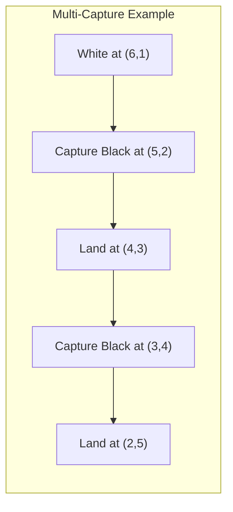

```
Before:                    After:
  0 1 2 3 4 5 6 7           0 1 2 3 4 5 6 7
5     ?                   5     
4       ?                 4       
3         ?               3         
2           ??            2           ?
```

### Game End Conditions

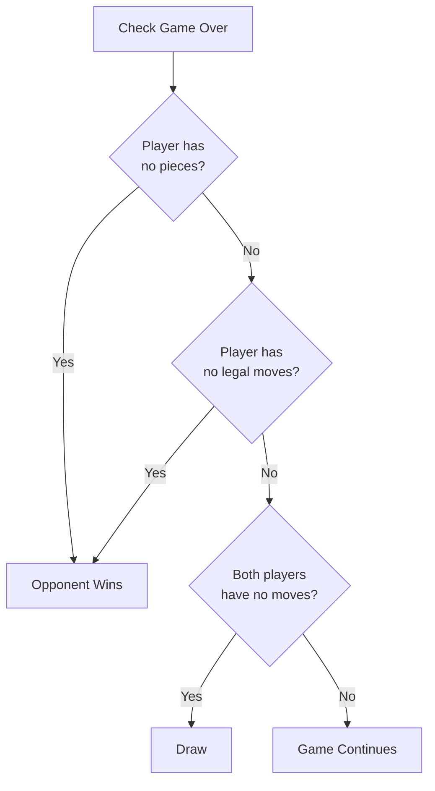

| Condition | Result |
|-----------|--------|
| Player has no pieces | Opponent wins |
| Player has no legal moves | Opponent wins |
| Both players have no moves | Draw |

---

## Game Flow

### Turn Sequence

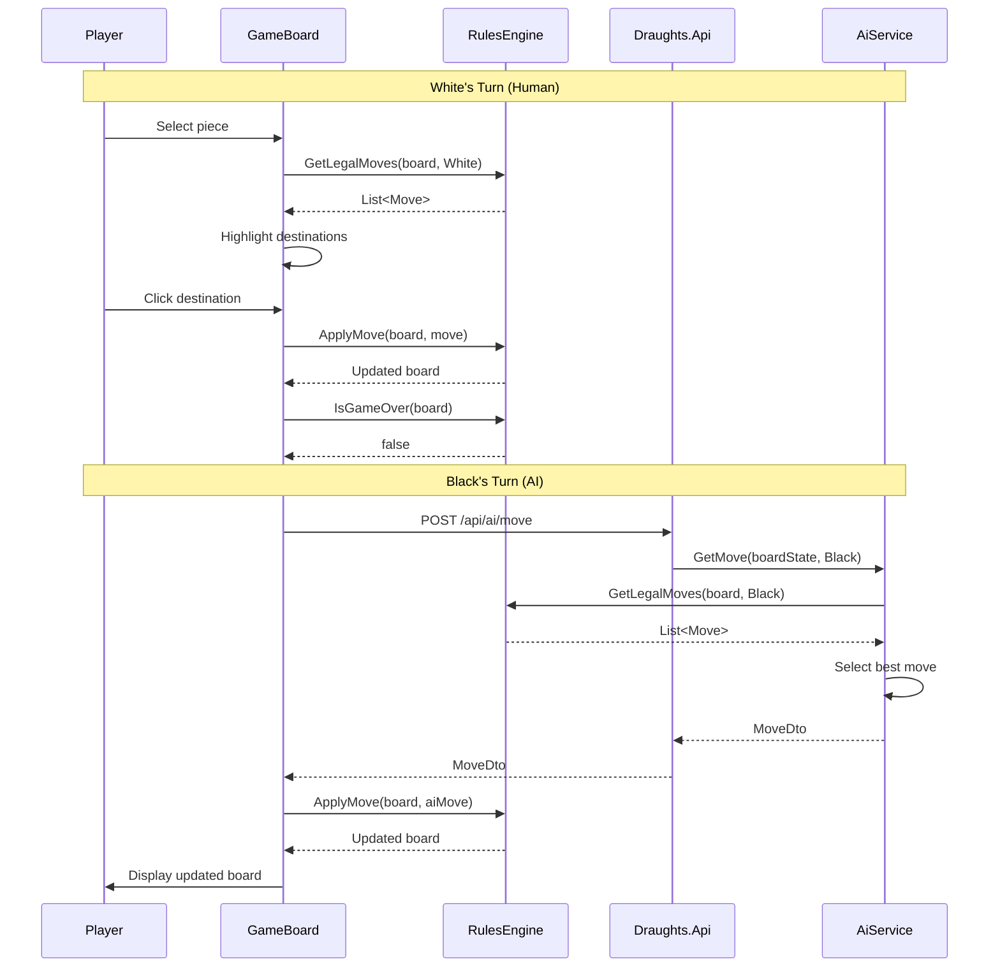

### State Machine

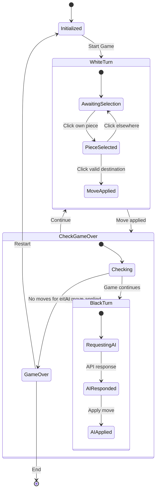

---

## AI Strategy

### Move Selection Algorithm

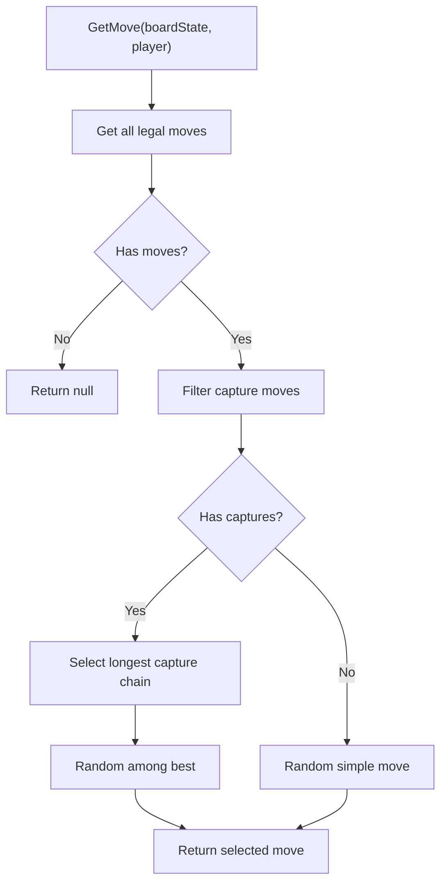

### Strategy Details

```csharp
public MoveDto? GetMove(BoardStateDto boardState, Player player)
{
    var board = MapToBoard(boardState);
    var moves = _rules.GetLegalMoves(board, player).ToList();

    if (moves.Count == 0)
        return null;

    // Prefer captures (mandatory in Spanish rules)
    var captures = moves.Where(m => m.IsCapture).ToList();
    var selectedMove = captures.Count > 0
        ? SelectBestCapture(captures)
        : SelectRandomMove(moves);

    return MapToDto(selectedMove);
}

private Move SelectBestCapture(List<Move> captures)
{
    // Prefer captures that take more pieces (longer chains)
    var maxCaptures = captures.Max(m => m.CapturedPositions?.Count ?? 0);
    var bestCaptures = captures
        .Where(m => (m.CapturedPositions?.Count ?? 0) == maxCaptures)
        .ToList();

    return bestCaptures[_random.Next(bestCaptures.Count)];
}
```

### AI Characteristics

| Aspect | Behavior |
|--------|----------|
| Difficulty | Basic (random selection) |
| Capture Priority | Always captures when available |
| Chain Priority | Prefers longest capture chain |
| Tie-Breaking | Random among equal options |
| Response Time | < 100ms typical |

---

## Testing the Domain

### Unit Test Categories

| Category | Tests |
|----------|-------|
| Board Creation | Initial state, coordinate validation |
| Simple Moves | Man forward movement, King diagonal movement |
| Capture Moves | Single capture, multi-capture chains |
| Mandatory Capture | Only captures returned when available |
| Promotion | Man becomes King at back row |
| Game Over | No pieces, no moves, draw conditions |

### Example Test Cases

```csharp
[Fact]
public void ManCapture_WhenOpponentAdjacent_ReturnsOnlyCaptureMove()
{
    // Arrange: White man at (5,2), Black man at (4,3)
    var board = new Board();
    board.Set(5, 2, new Piece(Player.White, PieceType.Man));
    board.Set(4, 3, new Piece(Player.Black, PieceType.Man));

    // Act
    var moves = _engine.GetLegalMoves(board, Player.White).ToList();

    // Assert: Only capture move available (mandatory capture)
    Assert.Single(moves);
    Assert.True(moves[0].IsCapture);
    Assert.Contains((4, 3), moves[0].CapturedPositions!);
}

[Fact]
public void MultiCapture_WhenChainAvailable_ReturnsFullChain()
{
    // Arrange: Setup for double capture
    var board = new Board();
    board.Set(6, 1, new Piece(Player.White, PieceType.Man));
    board.Set(5, 2, new Piece(Player.Black, PieceType.Man));
    board.Set(3, 4, new Piece(Player.Black, PieceType.Man));

    // Act
    var moves = _engine.GetLegalMoves(board, Player.White).ToList();

    // Assert: Multi-capture chain returned
    var multiCapture = moves.FirstOrDefault(m => 
        m.CapturedPositions?.Count == 2);
    Assert.NotNull(multiCapture);
}
```

---

*See also: [Code Overview](code-overview.md) | [API Reference](api-reference.md) | [Development Guide](development-guide.md)*
